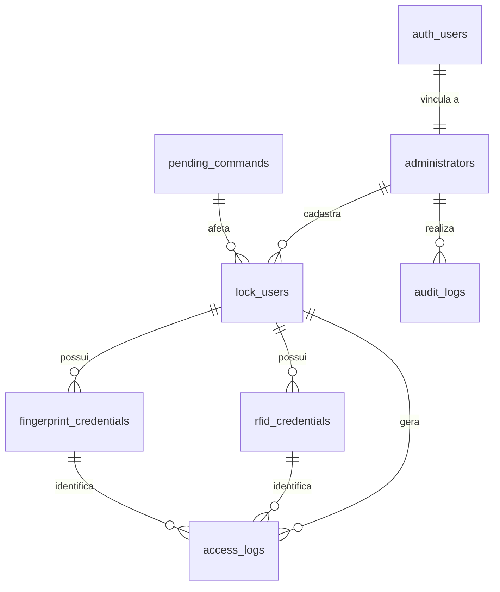

# Modelagem do Banco de Dados SQL (PostgreSQL / Supabase)

Com base nos requisitos do `design.md` e nas telas implementadas, estruturamos o banco de dados relacional. Como o projeto utiliza **Supabase**, a modelagem foi construída usando a sintaxe do **PostgreSQL**, tirando proveito de tipos avançados (como `JSONB` e `UUID`) e políticas de segurança RLS (Row Level Security).

---

## 1. Diagrama de Relacionamento (Entidade-Relacionamento)



---

## 2. Tabelas e DDL (Data Definition Language)

### 2.1 Schema de Autenticação e Administradores

Os administradores do aplicativo são vinculados à autenticação nativa do Supabase (`auth.users`). Criamos uma tabela de perfil administrativo (`administrators`) para controle de permissões.

```sql
-- Enum para papéis de administradores
CREATE TYPE admin_role AS ENUM ('SUPER_ADMIN', 'ADMIN');

-- Tabela de Administradores
CREATE TABLE public.administrators (
    id UUID PRIMARY KEY REFERENCES auth.users(id) ON DELETE CASCADE,
    name VARCHAR(255) NOT NULL,
    login VARCHAR(100) UNIQUE NOT NULL,
    email VARCHAR(255) UNIQUE NOT NULL,
    role admin_role NOT NULL DEFAULT 'ADMIN',
    status VARCHAR(20) NOT NULL CHECK (status IN ('active', 'inactive')) DEFAULT 'active',
    created_at TIMESTAMP WITH TIME ZONE DEFAULT TIMEZONE('utc'::text, NOW()) NOT NULL,
    last_access TIMESTAMP WITH TIME ZONE
);
```

### 2.2 Schema de Usuários da Fechadura

Os usuários que abrem a porta **não** são os administradores que acessam o aplicativo. Eles residem em uma tabela operacional distinta (`lock_users`).

```sql
-- Enum para status de sincronização
CREATE TYPE sync_status AS ENUM ('synced', 'pending', 'error');
-- Enum para status do usuário
CREATE TYPE user_status AS ENUM ('active', 'pending', 'blocked');

CREATE TABLE public.lock_users (
    id UUID PRIMARY KEY DEFAULT gen_random_uuid(),
    name VARCHAR(255) NOT NULL,
    email VARCHAR(255),
    status user_status NOT NULL DEFAULT 'pending',
    sync_status sync_status NOT NULL DEFAULT 'pending',
    created_by UUID REFERENCES public.administrators(id) ON DELETE SET NULL,
    created_at TIMESTAMP WITH TIME ZONE DEFAULT TIMEZONE('utc'::text, NOW()) NOT NULL,
    updated_at TIMESTAMP WITH TIME ZONE DEFAULT TIMEZONE('utc'::text, NOW()) NOT NULL
);
```

### 2.3 Schema de Credenciais Físicas

Modelamos credenciais separadamente para permitir que um usuário tenha múltiplos métodos de acesso (ex: um chaveiro RFID e biometria de dedos diferentes).

```sql
-- Credenciais RFID
CREATE TABLE public.rfid_credentials (
    id UUID PRIMARY KEY DEFAULT gen_random_uuid(),
    user_id UUID NOT NULL REFERENCES public.lock_users(id) ON DELETE CASCADE,
    rfid_uid VARCHAR(50) UNIQUE NOT NULL, -- UID físico lido pelo leitor MFRC522
    status VARCHAR(20) NOT NULL CHECK (status IN ('active', 'inactive')) DEFAULT 'active',
    sync_status sync_status NOT NULL DEFAULT 'pending',
    created_at TIMESTAMP WITH TIME ZONE DEFAULT TIMEZONE('utc'::text, NOW()) NOT NULL
);

-- Credenciais Biométricas (Digitais)
CREATE TABLE public.fingerprint_credentials (
    id UUID PRIMARY KEY DEFAULT gen_random_uuid(),
    user_id UUID NOT NULL REFERENCES public.lock_users(id) ON DELETE CASCADE,
    fingerprint_index INT UNIQUE NOT NULL CHECK (fingerprint_index BETWEEN 0 AND 99), -- Índice interno no leitor óptico
    fingerprint_name VARCHAR(50) NOT NULL, -- Nome do dedo (ex: "indicador direito")
    status VARCHAR(20) NOT NULL CHECK (status IN ('active', 'inactive')) DEFAULT 'active',
    sync_status sync_status NOT NULL DEFAULT 'pending',
    created_at TIMESTAMP WITH TIME ZONE DEFAULT TIMEZONE('utc'::text, NOW()) NOT NULL
);
```

### 2.4 Fila de Comandos (ESP32 Integration)

Controla a fila de ações remotas que precisam ser sincronizadas ou executadas fisicamente no módulo ESP32.

```sql
-- Enum para tipos de comando
CREATE TYPE command_type AS ENUM (
    'revoke_rfid',
    'revoke_finger',
    'block_user',
    'sync_credentials',
    'clear_local_data'
);

-- Enum para status do comando
CREATE TYPE command_status AS ENUM (
    'pending',
    'sent',
    'applied',
    'failed',
    'expired'
);

CREATE TABLE public.pending_commands (
    id UUID PRIMARY KEY DEFAULT gen_random_uuid(),
    type command_type NOT NULL,
    target_user_id UUID REFERENCES public.lock_users(id) ON DELETE CASCADE,
    status command_status NOT NULL DEFAULT 'pending',
    details TEXT,
    error_details TEXT,
    created_at TIMESTAMP WITH TIME ZONE DEFAULT TIMEZONE('utc'::text, NOW()) NOT NULL,
    updated_at TIMESTAMP WITH TIME ZONE DEFAULT TIMEZONE('utc'::text, NOW()) NOT NULL
);
```

### 2.5 Histórico de Acessos

Registra as aberturas (ou tentativas negadas) geradas fisicamente no leitor da fechadura.

```sql
-- Enum para método de entrada
CREATE TYPE access_method AS ENUM ('rfid', 'digital');
-- Enum para resultado de acesso
CREATE TYPE access_result AS ENUM ('authorized', 'denied');

CREATE TABLE public.access_logs (
    id UUID PRIMARY KEY DEFAULT gen_random_uuid(),
    user_id UUID REFERENCES public.lock_users(id) ON DELETE SET NULL, -- Nulo caso RFID/Digital desconhecido
    rfid_uid VARCHAR(50), -- Guardado para rastreabilidade em caso de cartão não cadastrado
    fingerprint_index INT, -- Guardado para logs de digital desconhecida
    method access_method NOT NULL,
    result access_result NOT NULL,
    timestamp TIMESTAMP WITH TIME ZONE DEFAULT TIMEZONE('utc'::text, NOW()) NOT NULL
);
```

### 2.6 Logs Técnicos e Auditoria Administrativa

Registra as ações críticas tomadas no app pelos administradores (IAM, alteração de parâmetros, conexões BLE).

```sql
-- Enum para severidade do log técnico
CREATE TYPE log_status AS ENUM ('success', 'failure', 'warning');

CREATE TABLE public.technical_logs (
    id UUID PRIMARY KEY DEFAULT gen_random_uuid(),
    type VARCHAR(50) NOT NULL, -- Ex: 'login_admin', 'create_user', 'ble_failure', etc.
    title VARCHAR(255) NOT NULL,
    description TEXT NOT NULL,
    operator_id UUID REFERENCES public.administrators(id) ON DELETE SET NULL, -- Nulo se automático do sistema
    device_info VARCHAR(255),
    status log_status NOT NULL DEFAULT 'success',
    payload JSONB, -- Armazena metadados complexos do evento (IDs, IPs, erros brutos)
    created_at TIMESTAMP WITH TIME ZONE DEFAULT TIMEZONE('utc'::text, NOW()) NOT NULL
);
```

---

## 3. Índices e Otimizações de Consulta (Performance)

Adicionamos índices nas chaves mais buscadas nas listagens e filtros do app:

```sql
-- Busca rápida de usuários por nome (case insensitive)
CREATE INDEX idx_lock_users_name ON public.lock_users (LOWER(name));

-- Busca de credenciais ativas vinculadas a usuários
CREATE INDEX idx_rfid_user_id ON public.rfid_credentials (user_id);
CREATE INDEX idx_fingerprint_user_id ON public.fingerprint_credentials (user_id);

-- Fila de comandos pendentes/enviados consumida pela fechadura
CREATE INDEX idx_pending_commands_status ON public.pending_commands (status)
WHERE status IN ('pending', 'sent');

-- Filtros cronológicos do Histórico de Acesso e Auditoria
CREATE INDEX idx_access_logs_timestamp ON public.access_logs (timestamp DESC);
CREATE INDEX idx_technical_logs_created_at ON public.technical_logs (created_at DESC);
```

---

## 4. Segurança e RLS (Row Level Security)

Como o banco utiliza Supabase, configuramos a proteção para garantir que **apenas administradores ativos** possam ler e modificar os dados operacionais. A segurança da própria tabela de administradores foi otimizada para evitar referências inseguras a metadados no cliente (`user_metadata`) e loops de recursão infinita (erro `42P17`):

```sql
-- Ativar RLS nas tabelas principais
ALTER TABLE public.administrators ENABLE ROW LEVEL SECURITY;
ALTER TABLE public.lock_users ENABLE ROW LEVEL SECURITY;
ALTER TABLE public.rfid_credentials ENABLE ROW LEVEL SECURITY;
ALTER TABLE public.fingerprint_credentials ENABLE ROW LEVEL SECURITY;
ALTER TABLE public.pending_commands ENABLE ROW LEVEL SECURITY;
ALTER TABLE public.access_logs ENABLE ROW LEVEL SECURITY;
ALTER TABLE public.technical_logs ENABLE ROW LEVEL SECURITY;

-- 4.1 Funções auxiliares (SECURITY DEFINER + SET search_path para prevenção de loops de RLS)
CREATE OR REPLACE FUNCTION public.is_active_admin()
RETURNS BOOLEAN AS $$
BEGIN
  RETURN EXISTS (
    SELECT 1 FROM public.administrators
    WHERE id = auth.uid() AND status = 'active'
  );
END;
$$ LANGUAGE plpgsql SECURITY DEFINER SET search_path = public;

CREATE OR REPLACE FUNCTION public.is_super_admin()
RETURNS BOOLEAN AS $$
BEGIN
  RETURN EXISTS (
    SELECT 1 FROM public.administrators
    WHERE id = auth.uid() AND role = 'SUPER_ADMIN'::public.admin_role AND status = 'active'
  );
END;
$$ LANGUAGE plpgsql SECURITY DEFINER SET search_path = public;

-- 4.2 Trigger de validação de atualizações na tabela administrators
CREATE OR REPLACE FUNCTION public.check_admin_update()
RETURNS TRIGGER AS $$
BEGIN
  -- Se o operador logado for um SUPER_ADMIN ativo, permite qualquer alteração
  IF EXISTS (
    SELECT 1 FROM public.administrators
    WHERE id = auth.uid() AND role = 'SUPER_ADMIN'::public.admin_role AND status = 'active'
  ) THEN
    RETURN NEW;
  END IF;

  -- Se não for super admin, o usuário só pode atualizar o próprio perfil (ex: last_access)
  IF auth.uid() <> NEW.id THEN
    RAISE EXCEPTION 'Acesso negado. Apenas super administradores podem gerenciar outros perfis.';
  END IF;

  -- Um administrador comum não pode mudar o seu próprio papel (role) ou status
  IF NEW.role <> OLD.role OR NEW.status <> OLD.status THEN
    RAISE EXCEPTION 'Acesso negado. Você não pode alterar seu próprio papel (role) ou status.';
  END IF;

  RETURN NEW;
END;
$$ LANGUAGE plpgsql SECURITY DEFINER SET search_path = public;

CREATE TRIGGER before_admin_update
  BEFORE UPDATE ON public.administrators
  FOR EACH ROW EXECUTE FUNCTION public.check_admin_update();

-- 4.3 Políticas RLS seguras para administrators (livres de recursão)
CREATE POLICY "Permitir leitura de si mesmo ou por admins ativos" ON public.administrators
    FOR SELECT TO authenticated
    USING (auth.uid() = id OR public.is_active_admin());

CREATE POLICY "Permitir update para si mesmo ou super admins" ON public.administrators
    FOR UPDATE TO authenticated
    USING (auth.uid() = id OR public.is_super_admin());

CREATE POLICY "Permitir delete apenas para super admins" ON public.administrators
    FOR DELETE TO authenticated
    USING (public.is_super_admin());

-- 4.4 Políticas para as tabelas operacionais (lock_users, rfid_credentials, fingerprint_credentials, etc.)
CREATE POLICY "Administradores ativos operam lock_users" ON public.lock_users
    FOR ALL TO authenticated USING (public.is_active_admin()) WITH CHECK (public.is_active_admin());

CREATE POLICY "Administradores ativos operam rfid_credentials" ON public.rfid_credentials
    FOR ALL TO authenticated USING (public.is_active_admin()) WITH CHECK (public.is_active_admin());

CREATE POLICY "Administradores ativos operam fingerprint_credentials" ON public.fingerprint_credentials
    FOR ALL TO authenticated USING (public.is_active_admin()) WITH CHECK (public.is_active_admin());

CREATE POLICY "Administradores ativos operam pending_commands" ON public.pending_commands
    FOR ALL TO authenticated USING (public.is_active_admin()) WITH CHECK (public.is_active_admin());

CREATE POLICY "Administradores ativos operam access_logs" ON public.access_logs
    FOR ALL TO authenticated USING (public.is_active_admin()) WITH CHECK (public.is_active_admin());

CREATE POLICY "Administradores ativos operam technical_logs" ON public.technical_logs
    FOR ALL TO authenticated USING (public.is_active_admin()) WITH CHECK (public.is_active_admin());
```
