# Documentação de Fluxos — PET Lock (ESP32 Firmware)

> **Projeto:** PET Lock — Controle de Acesso Biométrico  
> **Plataforma:** ESP32 (FreeRTOS dual-core)  
> **Arquitetura:** Clean Architecture (Interfaces → Use Cases → Adapters)

---

## 📋 Documentação dos Fluxos — PET Lock

### 1. 🔏 Autenticação via Impressão Digital (ZW111 / UART2)
- **Scan:** A `AuthTask` chama `FingerprintAdapter::scan()` a cada 100ms, que executa `getImage()` → `image2Tz()` → `fingerSearch()` via UART2
- **Cadastro:** 2 capturas obrigatórias (`captureStep(1)` e `captureStep(2)`), combinadas com `createModel()` e persistidas no slot físico do sensor
- **LED RGB:** Controlado por pacote UART customizado de 15 bytes com checksum

### 2. 📡 Autenticação via RFID (RC522 / SPI)
- O RC522 **compartilha o barramento SPI** com o display, usando `xSPI_Mutex` com **timeout curto de 15ms** para não bloquear a AuthTask
- UID de 4 bytes é convertido em `uint32_t` e consultado no mapeamento local NVS

### 3. 🖥️ Comunicação com o Display (ST7789 / SPI)
- 9 estados de tela documentados com diagrama de máquina de estados
- Barra de status (WiFi/BLE/Sync) é atualizada de forma não-bloqueante por setters chamados pelas tasks de rede

### 4. ☁️ Comunicação com Supabase (HTTPS / Wi-Fi)
- Sincronização inicial: NTP → `syncOfflineLogs()` → `fetchDatabaseMappings()` (3 GETs para users, rfids e fingerprints)
- Sincronização periódica a cada **5 minutos**; logs offline armazenados em NVS com limite de **50 entradas**
- TLS sem verificação de certificado (`setInsecure()`)

### 5. 📱 Comunicação BLE com o App (Nordic UART / NimBLE)
- **Reassembly** de fragmentos JSON implementado por contagem de chaves `{}`
- 2 comandos recebidos do app: `enter_enroll` e `remote_open`
- Notificações de `system_status` (ao conectar) e `enroll_status` (durante cadastro) com tabela completa de status/erros

---

## Visão Geral da Arquitetura

O firmware é organizado em **4 tarefas FreeRTOS** que rodam em paralelo nos dois núcleos do ESP32:

| Task | Core | Prioridade | Responsabilidade |
|------|------|-----------|-----------------|
| `AuthTask` | Core 1 | Alta (3) | Leitura de digital e RFID |
| `BleTask` | Core 0 | Média (2) | Gerenciamento BLE e comandos do app |
| `SyncTask` | Core 0 | Baixa (1) | Wi-Fi, NTP, sincronização Supabase |
| `SystemTask` | Core 1 | Baixa (1) | Botão de wipe físico *(desativado)* |

**Mutexes compartilhados:**
- `xSPI_Mutex` — controla acesso ao barramento SPI (Display ST7789 + RFID RC522)
- `xLocalDB_Mutex` — serializa acesso ao storage NVS (Preferences)

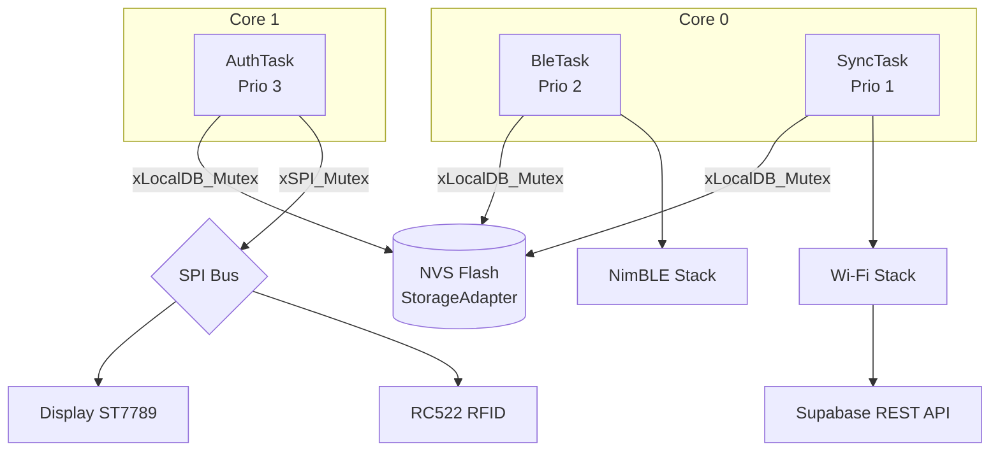
```mermaid
graph TD
    subgraph Core1["Core 1"]
        AT[AuthTask<br/>Prio 3]
    end
    subgraph Core0["Core 0"]
        BT[BleTask<br/>Prio 2]
        ST[SyncTask<br/>Prio 1]
    end

    AT -->|xLocalDB_Mutex| DB[(NVS Flash<br/>StorageAdapter)]
    BT -->|xLocalDB_Mutex| DB
    ST -->|xLocalDB_Mutex| DB

    AT -->|xSPI_Mutex| SPI{SPI Bus}
    SPI --> DISP[Display ST7789]
    SPI --> RFID[RC522 RFID]

    BT --> BLE[NimBLE Stack]
    ST --> WIFI[Wi-Fi Stack]
    WIFI --> SUP[Supabase REST API]
```

---

## 1. Fluxo de Autenticação via Impressão Digital

### Hardware
- **Sensor:** ZW111 (capacitivo), protocolo **UART2** (57600 bps)
- **Pinos:** `RX2=16`, `TX2=17`
- **Arquivo:** [`FingerprintAdapter.cpp`](file:///s:/dev/UFC/pet-lock/pet-lock-esp/src/Adapters/FingerprintAdapter.cpp)
- **Use Case:** [`AccessControlUseCase.cpp`](file:///s:/dev/UFC/pet-lock/pet-lock-esp/src/Core/UseCases/AccessControlUseCase.cpp)

### Fluxo — Acesso Normal

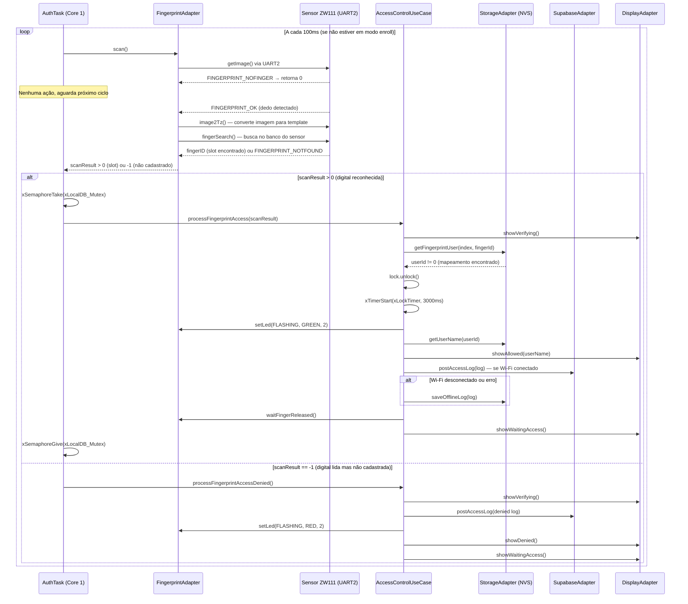
```mermaid
sequenceDiagram
    participant AT as AuthTask (Core 1)
    participant FA as FingerprintAdapter
    participant ZW as Sensor ZW111 (UART2)
    participant UC as AccessControlUseCase
    participant DB as StorageAdapter (NVS)
    participant SB as SupabaseAdapter
    participant DI as DisplayAdapter

    loop A cada 100ms (se não estiver em modo enroll)
        AT->>FA: scan()
        FA->>ZW: getImage() via UART2
        ZW-->>FA: FINGERPRINT_NOFINGER → retorna 0
        Note over AT: Nenhuma ação, aguarda próximo ciclo

        ZW-->>FA: FINGERPRINT_OK (dedo detectado)
        FA->>ZW: image2Tz() — converte imagem para template
        FA->>ZW: fingerSearch() — busca no banco do sensor
        ZW-->>FA: fingerID (slot encontrado) ou FINGERPRINT_NOTFOUND
        FA-->>AT: scanResult > 0 (slot) ou -1 (não cadastrado)

        alt scanResult > 0 (digital reconhecida)
            AT->>AT: xSemaphoreTake(xLocalDB_Mutex)
            AT->>UC: processFingerprintAccess(scanResult)
            UC->>DI: showVerifying()
            UC->>DB: getFingerprintUser(index, fingerId)
            DB-->>UC: userId != 0 (mapeamento encontrado)
            UC->>UC: lock.unlock()
            UC->>UC: xTimerStart(xLockTimer, 3000ms)
            UC->>FA: setLed(FLASHING, GREEN, 2)
            UC->>DB: getUserName(userId)
            UC->>DI: showAllowed(userName)
            UC->>SB: postAccessLog(log) — se Wi-Fi conectado
            alt Wi-Fi desconectado ou erro
                UC->>DB: saveOfflineLog(log)
            end
            UC->>FA: waitFingerReleased()
            UC->>DI: showWaitingAccess()
            AT->>AT: xSemaphoreGive(xLocalDB_Mutex)

        else scanResult == -1 (digital lida mas não cadastrada)
            AT->>UC: processFingerprintAccessDenied()
            UC->>DI: showVerifying()
            UC->>SB: postAccessLog(denied log)
            UC->>FA: setLed(FLASHING, RED, 2)
            UC->>DI: showDenied()
            UC->>DI: showWaitingAccess()
        end
    end
```

### Fluxo — Cadastro de Digital (Enroll)

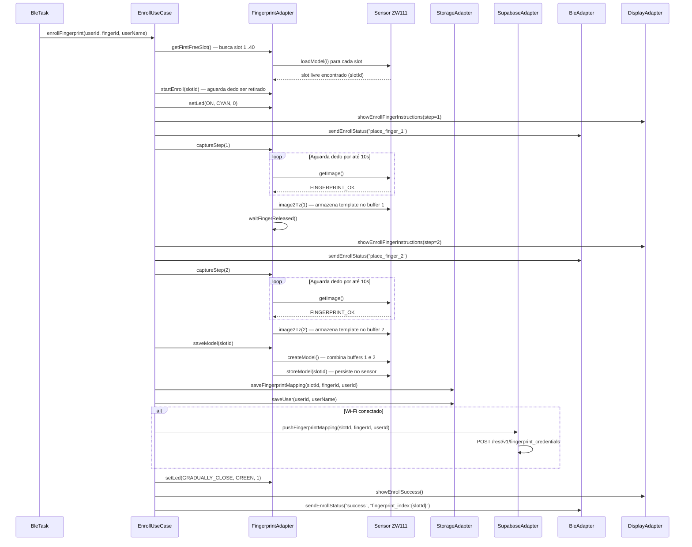
```mermaid
sequenceDiagram
    participant BT as BleTask
    participant EU as EnrollUseCase
    participant FA as FingerprintAdapter
    participant ZW as Sensor ZW111
    participant DB as StorageAdapter
    participant SB as SupabaseAdapter
    participant BL as BleAdapter
    participant DI as DisplayAdapter

    BT->>EU: enrollFingerprint(userId, fingerId, userName)
    EU->>FA: getFirstFreeSlot() — busca slot 1..40
    FA->>ZW: loadModel(i) para cada slot
    ZW-->>FA: slot livre encontrado (slotId)

    EU->>FA: startEnroll(slotId) — aguarda dedo ser retirado
    EU->>FA: setLed(ON, CYAN, 0)
    EU->>DI: showEnrollFingerInstructions(step=1)
    EU->>BL: sendEnrollStatus("place_finger_1")

    EU->>FA: captureStep(1)
    loop Aguarda dedo por até 10s
        FA->>ZW: getImage()
        ZW-->>FA: FINGERPRINT_OK
    end
    FA->>ZW: image2Tz(1) — armazena template no buffer 1
    FA->>FA: waitFingerReleased()

    EU->>DI: showEnrollFingerInstructions(step=2)
    EU->>BL: sendEnrollStatus("place_finger_2")

    EU->>FA: captureStep(2)
    loop Aguarda dedo por até 10s
        FA->>ZW: getImage()
        ZW-->>FA: FINGERPRINT_OK
    end
    FA->>ZW: image2Tz(2) — armazena template no buffer 2

    EU->>FA: saveModel(slotId)
    FA->>ZW: createModel() — combina buffers 1 e 2
    FA->>ZW: storeModel(slotId) — persiste no sensor

    EU->>DB: saveFingerprintMapping(slotId, fingerId, userId)
    EU->>DB: saveUser(userId, userName)

    alt Wi-Fi conectado
        EU->>SB: pushFingerprintMapping(slotId, fingerId, userId)
        SB->>SB: POST /rest/v1/fingerprint_credentials
    end

    EU->>FA: setLed(GRADUALLY_CLOSE, GREEN, 1)
    EU->>DI: showEnrollSuccess()
    EU->>BL: sendEnrollStatus("success", "fingerprint_index:{slotId}")
```

### Protocolo de Controle de LED (ZW111)

O sensor possui um LED RGB controlado por pacote UART customizado:

```
[EF 01] [FF FF FF FF] [01] [00 07] [3C] [mode] [startColor] [endColor] [cycles] [CKS_H] [CKS_L]
```

| Campo | Bytes | Descrição |
|-------|-------|-----------|
| Header | `EF 01` | Fixo |
| Address | `FF FF FF FF` | Broadcast |
| Packet ID | `01` | Comando |
| Length | `00 07` | 7 bytes de dados |
| Instruction | `3C` | Control LED |
| Mode | 1 byte | ON/OFF/FLASHING/BREATHING |
| Colors | 2 bytes | startColor / endColor |
| Cycles | 1 byte | 0 = infinito |
| Checksum | 2 bytes | Soma de todos os bytes de dados |

---

## 2. Fluxo de Autenticação via RFID

### Hardware
- **Leitor:** MFRC522 (Mifare Classic 13.56 MHz), protocolo **SPI compartilhado**
- **Pinos:** `CS=5`, `RST=22`, `MOSI=23`, `MISO=19`, `SCK=18`
- **Arquivo:** [`RfidAdapter.cpp`](file:///s:/dev/UFC/pet-lock/pet-lock-esp/src/Adapters/RfidAdapter.cpp)

> [!IMPORTANT]
> O RC522 e o Display ST7789 **compartilham o mesmo barramento SPI**. O acesso é serializado via `xSPI_Mutex`. O `RfidAdapter` usa um **timeout de 15ms** ao tentar adquirir o mutex para evitar bloqueio da `AuthTask` enquanto o display está sendo atualizado.

### Fluxo — Acesso Normal

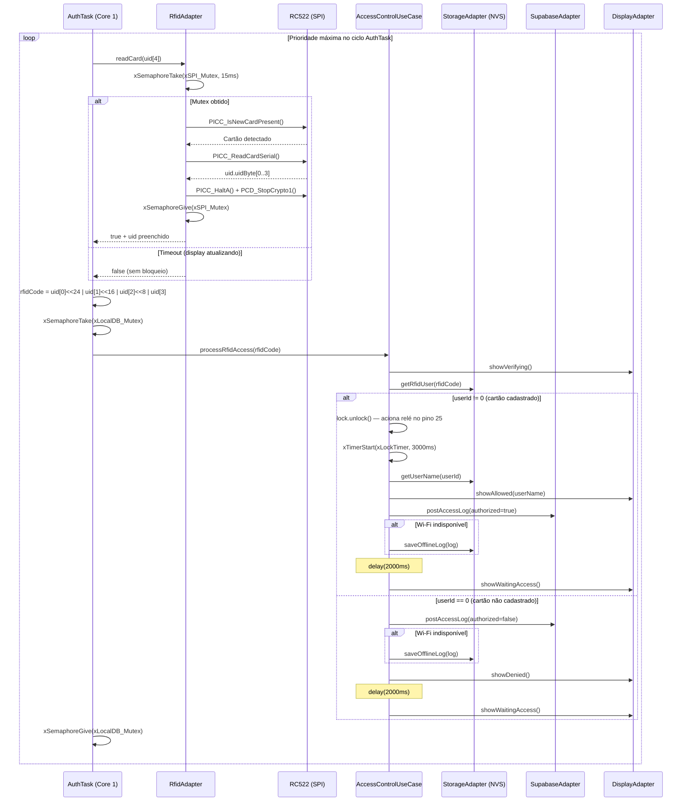
```mermaid
sequenceDiagram
    participant AT as AuthTask (Core 1)
    participant RA as RfidAdapter
    participant RC as RC522 (SPI)
    participant UC as AccessControlUseCase
    participant DB as StorageAdapter (NVS)
    participant SB as SupabaseAdapter
    participant DI as DisplayAdapter

    loop Prioridade máxima no ciclo AuthTask
        AT->>RA: readCard(uid[4])
        RA->>RA: xSemaphoreTake(xSPI_Mutex, 15ms)
        alt Mutex obtido
            RA->>RC: PICC_IsNewCardPresent()
            RC-->>RA: Cartão detectado
            RA->>RC: PICC_ReadCardSerial()
            RC-->>RA: uid.uidByte[0..3]
            RA->>RC: PICC_HaltA() + PCD_StopCrypto1()
            RA->>RA: xSemaphoreGive(xSPI_Mutex)
            RA-->>AT: true + uid preenchido
        else Timeout (display atualizando)
            RA-->>AT: false (sem bloqueio)
        end

        AT->>AT: rfidCode = uid[0]<<24 | uid[1]<<16 | uid[2]<<8 | uid[3]
        AT->>AT: xSemaphoreTake(xLocalDB_Mutex)
        AT->>UC: processRfidAccess(rfidCode)

        UC->>DI: showVerifying()
        UC->>DB: getRfidUser(rfidCode)

        alt userId != 0 (cartão cadastrado)
            UC->>UC: lock.unlock() — aciona relé no pino 25
            UC->>UC: xTimerStart(xLockTimer, 3000ms)
            UC->>DB: getUserName(userId)
            UC->>DI: showAllowed(userName)
            UC->>SB: postAccessLog(authorized=true)
            alt Wi-Fi indisponível
                UC->>DB: saveOfflineLog(log)
            end
            Note over UC: delay(2000ms)
            UC->>DI: showWaitingAccess()

        else userId == 0 (cartão não cadastrado)
            UC->>SB: postAccessLog(authorized=false)
            alt Wi-Fi indisponível
                UC->>DB: saveOfflineLog(log)
            end
            UC->>DI: showDenied()
            Note over UC: delay(2000ms)
            UC->>DI: showWaitingAccess()
        end
        AT->>AT: xSemaphoreGive(xLocalDB_Mutex)
    end
```

### Fluxo — Cadastro de Cartão RFID (Enroll)

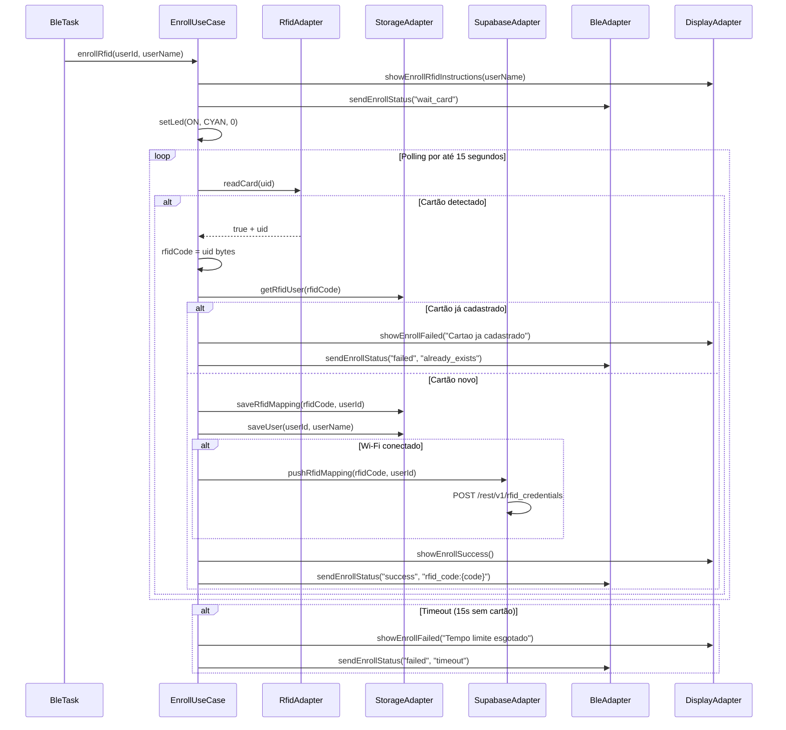
```mermaid
sequenceDiagram
    participant BT as BleTask
    participant EU as EnrollUseCase
    participant RA as RfidAdapter
    participant DB as StorageAdapter
    participant SB as SupabaseAdapter
    participant BL as BleAdapter
    participant DI as DisplayAdapter

    BT->>EU: enrollRfid(userId, userName)
    EU->>DI: showEnrollRfidInstructions(userName)
    EU->>BL: sendEnrollStatus("wait_card")
    EU->>EU: setLed(ON, CYAN, 0)

    loop Polling por até 15 segundos
        EU->>RA: readCard(uid)
        alt Cartão detectado
            RA-->>EU: true + uid
            EU->>EU: rfidCode = uid bytes
            EU->>DB: getRfidUser(rfidCode)
            alt Cartão já cadastrado
                EU->>DI: showEnrollFailed("Cartao ja cadastrado")
                EU->>BL: sendEnrollStatus("failed", "already_exists")
            else Cartão novo
                EU->>DB: saveRfidMapping(rfidCode, userId)
                EU->>DB: saveUser(userId, userName)
                alt Wi-Fi conectado
                    EU->>SB: pushRfidMapping(rfidCode, userId)
                    SB->>SB: POST /rest/v1/rfid_credentials
                end
                EU->>DI: showEnrollSuccess()
                EU->>BL: sendEnrollStatus("success", "rfid_code:{code}")
            end
        end
    end
    alt Timeout (15s sem cartão)
        EU->>DI: showEnrollFailed("Tempo limite esgotado")
        EU->>BL: sendEnrollStatus("failed", "timeout")
    end
```

---

## 3. Fluxo de Comunicação com o Display (ST7789)

### Hardware
- **Display:** IPS ST7789 240×320px, protocolo **SPI compartilhado**
- **Pinos:** `CS=15`, `DC=14`, `RST=4`, `MOSI=23`, `SCK=18`, `BLK=27`
- **Arquivo:** [`DisplayAdapter.cpp`](file:///s:/dev/UFC/pet-lock/pet-lock-esp/src/Adapters/DisplayAdapter.cpp)

### Estados e Telas

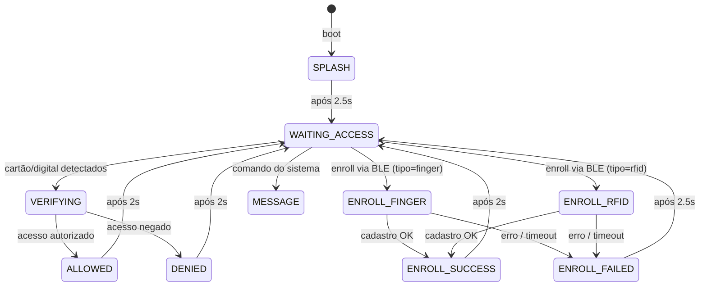
```mermaid
stateDiagram-v2
    [*] --> SPLASH: boot
    SPLASH --> WAITING_ACCESS: após 2.5s

    WAITING_ACCESS --> VERIFYING: cartão/digital detectados
    VERIFYING --> ALLOWED: acesso autorizado
    VERIFYING --> DENIED: acesso negado
    ALLOWED --> WAITING_ACCESS: após 2s
    DENIED --> WAITING_ACCESS: após 2s

    WAITING_ACCESS --> ENROLL_FINGER: enroll via BLE (tipo=finger)
    WAITING_ACCESS --> ENROLL_RFID: enroll via BLE (tipo=rfid)
    ENROLL_FINGER --> ENROLL_SUCCESS: cadastro OK
    ENROLL_FINGER --> ENROLL_FAILED: erro / timeout
    ENROLL_RFID --> ENROLL_SUCCESS: cadastro OK
    ENROLL_RFID --> ENROLL_FAILED: erro / timeout
    ENROLL_SUCCESS --> WAITING_ACCESS: após 2s
    ENROLL_FAILED --> WAITING_ACCESS: após 2.5s

    WAITING_ACCESS --> MESSAGE: comando do sistema
```

### Barra de Status (Atualização Dinâmica)

A barra de status no canto superior direito é **atualizada de forma não-bloqueante**. As tasks BLE e Sync chamam setters (`setWifiStatus`, `setBleStatus`, `setSyncStatus`), que internamente chamam `refreshStatusBar()` apenas se a tela atual permitir sobreposição.

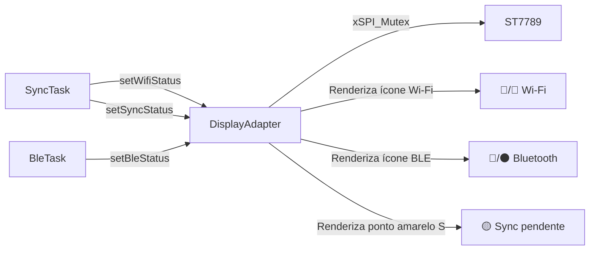
```mermaid
flowchart LR
    SyncTask -->|setWifiStatus| DA[DisplayAdapter]
    BleTask -->|setBleStatus| DA
    SyncTask -->|setSyncStatus| DA
    DA -->|xSPI_Mutex| ST7789

    DA -->|Renderiza ícone Wi-Fi| WIFI_ICON[🔵/🔴 Wi-Fi]
    DA -->|Renderiza ícone BLE| BLE_ICON[🔵/⚫ Bluetooth]
    DA -->|Renderiza ponto amarelo S| SYNC_ICON[🟡 Sync pendente]
```

### Acesso ao SPI — Semáforo

Toda operação de desenho no display usa o `xSPI_Mutex` com `portMAX_DELAY`, pois o display possui prioridade de atualização sobre o RFID (que usa timeout curto de 15ms).

```cpp
// Padrão de uso em todos os métodos do DisplayAdapter:
if (_spiMutex != NULL) xSemaphoreTake(_spiMutex, portMAX_DELAY);
// ... operações TFT ...
if (_spiMutex != NULL) xSemaphoreGive(_spiMutex);
```

---

## 4. Fluxo de Comunicação com o Supabase (via Wi-Fi)

### Configuração
- **Backend:** Supabase (PostgreSQL + PostgREST)
- **Protocolo:** HTTPS (TLS sem verificação de certificado — `setInsecure()`)
- **Biblioteca:** `WiFiClientSecure` + `HTTPClient`
- **Arquivo:** [`SupabaseAdapter.cpp`](file:///s:/dev/UFC/pet-lock/pet-lock-esp/src/Adapters/SupabaseAdapter.cpp)

### Tabelas no Supabase

| Tabela | Operações |
|--------|-----------|
| `lock_users` | GET (sync) |
| `fingerprint_credentials` | GET (sync) + POST (enroll) |
| `rfid_credentials` | GET (sync) + POST (enroll) |
| `access_logs` | POST (acesso autorizado/negado) |

### Fluxo — Inicialização e Sincronização Periódica (SyncTask)

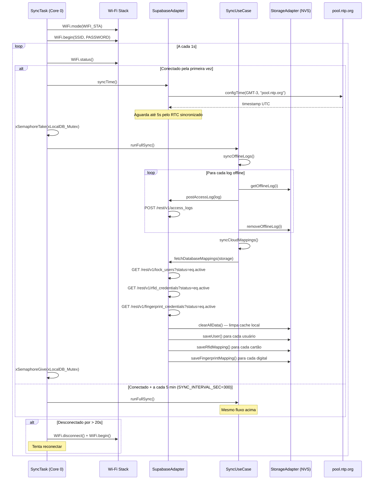
```mermaid
sequenceDiagram
    participant ST as SyncTask (Core 0)
    participant WF as Wi-Fi Stack
    participant SA as SupabaseAdapter
    participant SU as SyncUseCase
    participant DB as StorageAdapter (NVS)
    participant NTP as pool.ntp.org

    ST->>WF: WiFi.mode(WIFI_STA)
    ST->>WF: WiFi.begin(SSID, PASSWORD)

    loop A cada 1s
        ST->>WF: WiFi.status()

        alt Conectado pela primeira vez
            ST->>SA: syncTime()
            SA->>NTP: configTime(GMT-3, "pool.ntp.org")
            NTP-->>SA: timestamp UTC
            Note over SA: Aguarda até 5s pelo RTC sincronizado

            ST->>ST: xSemaphoreTake(xLocalDB_Mutex)
            ST->>SU: runFullSync()
            SU->>SU: syncOfflineLogs()
            loop Para cada log offline
                SU->>DB: getOfflineLog(i)
                SU->>SA: postAccessLog(log)
                SA->>SA: POST /rest/v1/access_logs
                SU->>DB: removeOfflineLog(i)
            end

            SU->>SU: syncCloudMappings()
            SU->>SA: fetchDatabaseMappings(storage)
            SA->>SA: GET /rest/v1/lock_users?status=eq.active
            SA->>SA: GET /rest/v1/rfid_credentials?status=eq.active
            SA->>SA: GET /rest/v1/fingerprint_credentials?status=eq.active
            SA->>DB: clearAllData() — limpa cache local
            SA->>DB: saveUser() para cada usuário
            SA->>DB: saveRfidMapping() para cada cartão
            SA->>DB: saveFingerprintMapping() para cada digital
            ST->>ST: xSemaphoreGive(xLocalDB_Mutex)

        else Conectado + a cada 5 min (SYNC_INTERVAL_SEC=300)
            ST->>SU: runFullSync()
            Note over SU: Mesmo fluxo acima
        end

        alt Desconectado por > 20s
            ST->>WF: WiFi.disconnect() + WiFi.begin()
            Note over ST: Tenta reconectar
        end
    end
```

### Fluxo — Registro de Log de Acesso

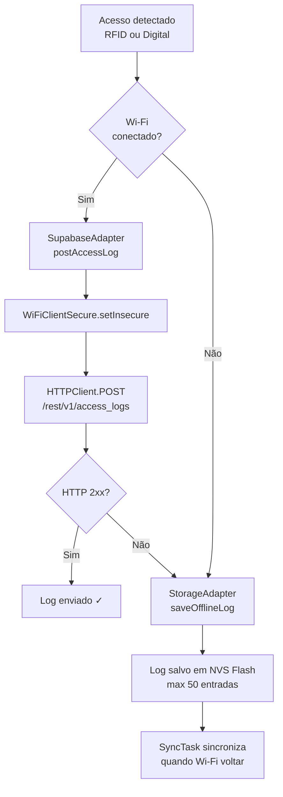
```mermaid
flowchart TD
    A[Acesso detectado<br/>RFID ou Digital] --> B{Wi-Fi<br/>conectado?}
    B -->|Sim| C[SupabaseAdapter<br/>postAccessLog]
    C --> D[WiFiClientSecure.setInsecure]
    D --> E[HTTPClient.POST<br/>/rest/v1/access_logs]
    E --> F{HTTP 2xx?}
    F -->|Sim| G[Log enviado ✓]
    F -->|Não| H[StorageAdapter<br/>saveOfflineLog]
    B -->|Não| H
    H --> I[Log salvo em NVS Flash<br/>max 50 entradas]
    I --> J[SyncTask sincroniza<br/>quando Wi-Fi voltar]
```

### Headers REST padrão

```http
POST /rest/v1/access_logs HTTP/1.1
apikey: {SUPABASE_ANON_KEY}
Authorization: Bearer {SUPABASE_ANON_KEY}
Content-Type: application/json
Prefer: return=minimal
Connection: close
```

### Formato do payload de log de acesso

```json
{
  "timestamp": "2024-01-15T14:30:00Z",
  "user_id": "uuid-do-usuario",
  "method": "digital",
  "fingerprint_index": 3,
  "rfid_uid": null,
  "result": "authorized"
}
```

---

## 5. Fluxo de Comunicação com o Celular (BLE)

### Configuração
- **Protocolo:** Bluetooth Low Energy (NimBLE stack)
- **Serviço:** Nordic UART Service (NUS)
- **Arquivo:** [`BleAdapter.cpp`](file:///s:/dev/UFC/pet-lock/pet-lock-esp/src/Adapters/BleAdapter.cpp)

### UUIDs BLE

| Recurso | UUID | Direção |
|---------|------|---------|
| Service | `6E400001-B5A3-F393-E0A9-E50E24DCCA9E` | — |
| RX Char | `6E400002-B5A3-F393-E0A9-E50E24DCCA9E` | App → ESP32 (Write) |
| TX Char | `6E400003-B5A3-F393-E0A9-E50E24DCCA9E` | ESP32 → App (Notify) |

### Fluxo — Inicialização e Advertising

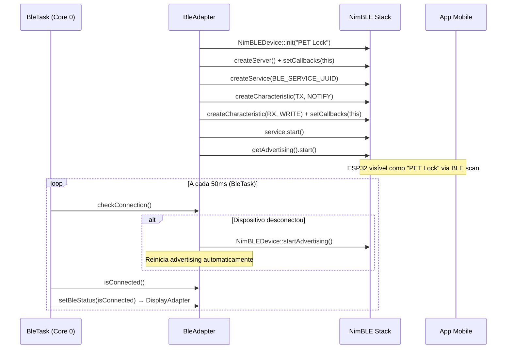
```mermaid
sequenceDiagram
    participant BT as BleTask (Core 0)
    participant BA as BleAdapter
    participant NB as NimBLE Stack
    participant APP as App Mobile

    BA->>NB: NimBLEDevice::init("PET Lock")
    BA->>NB: createServer() + setCallbacks(this)
    BA->>NB: createService(BLE_SERVICE_UUID)
    BA->>NB: createCharacteristic(TX, NOTIFY)
    BA->>NB: createCharacteristic(RX, WRITE) + setCallbacks(this)
    BA->>NB: service.start()
    BA->>NB: getAdvertising().start()
    Note over NB,APP: ESP32 visível como "PET Lock" via BLE scan

    loop A cada 50ms (BleTask)
        BT->>BA: checkConnection()
        alt Dispositivo desconectou
            BA->>NB: NimBLEDevice::startAdvertising()
            Note over BA: Reinicia advertising automaticamente
        end
        BT->>BA: isConnected()
        BT->>BA: setBleStatus(isConnected) → DisplayAdapter
    end
```

### Fluxo — Conexão do App e Status Inicial

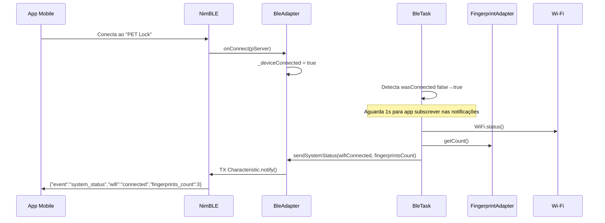
```mermaid
sequenceDiagram
    participant APP as App Mobile
    participant NB as NimBLE
    participant BA as BleAdapter
    participant BT as BleTask
    participant FA as FingerprintAdapter
    participant WF as Wi-Fi

    APP->>NB: Conecta ao "PET Lock"
    NB->>BA: onConnect(pServer)
    BA->>BA: _deviceConnected = true

    BT->>BT: Detecta wasConnected false→true
    Note over BT: Aguarda 1s para app subscrever nas notificações
    BT->>WF: WiFi.status()
    BT->>FA: getCount()
    BT->>BA: sendSystemStatus(wifiConnected, fingerprintsCount)
    BA->>NB: TX Characteristic.notify()
    NB->>APP: {"event":"system_status","wifi":"connected","fingerprints_count":3}
```

### Fluxo — Recebimento de Comando JSON

O BLE possui MTU limitado (tipicamente 20 bytes sem negociação). O `BleAdapter` implementa **reassembly de fragmentos** via contagem de chaves `{}`:

```mermaid
flowchart TD
    A[onWrite callback<br/>fragmento recebido] --> B[_rxBuffer += chunk]
    B --> C{Contém '{' ?}
    C -->|Não| D[Limpa _rxBuffer]
    C -->|Sim| E[Remove bytes antes do primeiro '{']
    E --> F{openBraces == closeBraces<br/>e openBraces > 0?}
    F -->|Não - JSON incompleto| G[Acumula mais fragmentos]
    F -->|Sim - JSON completo| H[_cmdQueue.push<br/>via _queueMutex]
    H --> I[BleTask processa<br/>no próximo ciclo]
```

### Fluxo — Processamento de Comandos

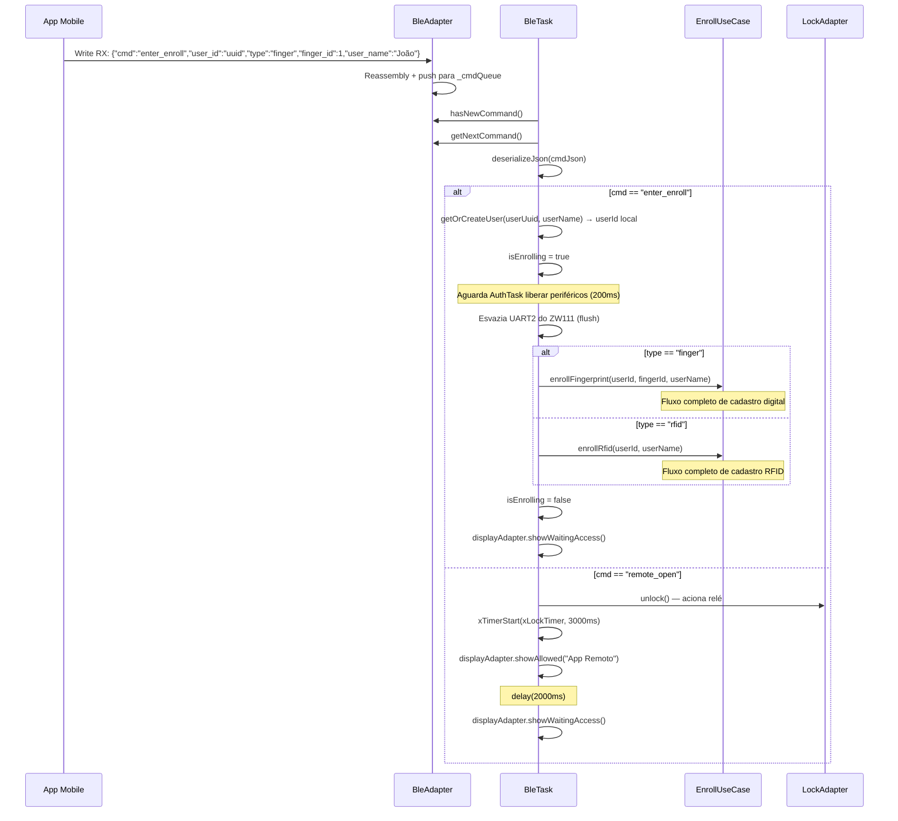
```mermaid
sequenceDiagram
    participant APP as App Mobile
    participant BA as BleAdapter
    participant BT as BleTask
    participant EU as EnrollUseCase
    participant LA as LockAdapter

    APP->>BA: Write RX: {"cmd":"enter_enroll","user_id":"uuid","type":"finger","finger_id":1,"user_name":"João"}
    BA->>BA: Reassembly + push para _cmdQueue

    BT->>BA: hasNewCommand()
    BT->>BA: getNextCommand()
    BT->>BT: deserializeJson(cmdJson)

    alt cmd == "enter_enroll"
        BT->>BT: getOrCreateUser(userUuid, userName) → userId local
        BT->>BT: isEnrolling = true
        Note over BT: Aguarda AuthTask liberar periféricos (200ms)
        BT->>BT: Esvazia UART2 do ZW111 (flush)

        alt type == "finger"
            BT->>EU: enrollFingerprint(userId, fingerId, userName)
            Note over EU: Fluxo completo de cadastro digital
        else type == "rfid"
            BT->>EU: enrollRfid(userId, userName)
            Note over EU: Fluxo completo de cadastro RFID
        end

        BT->>BT: isEnrolling = false
        BT->>BT: displayAdapter.showWaitingAccess()

    else cmd == "remote_open"
        BT->>LA: unlock() — aciona relé
        BT->>BT: xTimerStart(xLockTimer, 3000ms)
        BT->>BT: displayAdapter.showAllowed("App Remoto")
        Note over BT: delay(2000ms)
        BT->>BT: displayAdapter.showWaitingAccess()
    end
```

### Fluxo — Notificações do ESP32 para o App

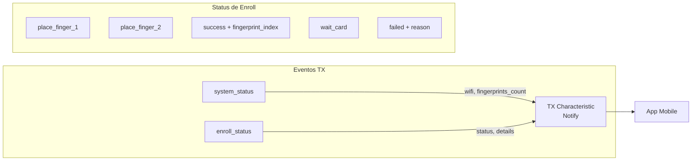
```mermaid
flowchart LR
    subgraph Eventos TX
        A[system_status] -->|"wifi, fingerprints_count"| TX
        B[enroll_status] -->|"status, details"| TX
    end

    TX[TX Characteristic<br/>Notify] --> APP[App Mobile]

    subgraph Status de Enroll
        S1["place_finger_1"]
        S2["place_finger_2"]
        S3["success + fingerprint_index"]
        S4["wait_card"]
        S5["failed + reason"]
    end
```

### Tabela de Mensagens BLE

#### App → ESP32 (Write na RX Characteristic)

| Campo `cmd` | Campos obrigatórios | Descrição |
|-------------|---------------------|-----------|
| `enter_enroll` | `user_id`, `type` (finger/rfid), `user_name`, `finger_id` (se finger) | Inicia modo de cadastro |
| `remote_open` | — | Abre a porta remotamente |

#### ESP32 → App (Notify na TX Characteristic)

| Campo `event` | Campos adicionais | Gatilho |
|---------------|-------------------|---------|
| `system_status` | `wifi`, `fingerprints_count` | Ao conectar |
| `enroll_status` | `status`, `details` (opcional) | Durante/após cadastro |

**Valores de `enroll_status.status`:**

| Status | Descrição |
|--------|-----------|
| `place_finger_1` | Aguardando 1ª captura de digital |
| `place_finger_2` | Aguardando 2ª captura de digital |
| `wait_card` | Aguardando aproximação do cartão RFID |
| `success` | Cadastro concluído com sucesso |
| `failed` | Falha, motivo em `details` |

**Valores de `details` em caso de falha:**

| Details | Causa |
|---------|-------|
| `no_local_slots` | Limite de 255 usuários locais atingido |
| `no_free_slots` | Sensor ZW111 sem slots livres (máx. 40) |
| `capture_1_failed` | Timeout ou erro na 1ª captura |
| `capture_2_failed` | Timeout ou erro na 2ª captura |
| `save_failed` | Erro ao persistir modelo no sensor |
| `timeout` | 15s sem aproximação do cartão RFID |
| `already_exists` | Cartão RFID já cadastrado |

---

## Apêndice — Temporizadores e Limites

| Parâmetro | Valor | Descrição |
|-----------|-------|-----------|
| `LOCK_UNLOCK_DURATION_MS` | 3000ms | Tempo de desbloqueio da fechadura |
| `SYNC_INTERVAL_SEC` | 300s (5min) | Intervalo de sync periódico Supabase |
| `WIFI_TIMEOUT_MS` | 15000ms | Timeout de reconexão Wi-Fi |
| `MAX_OFFLINE_LOGS` | 50 | Máximo de logs pendentes em NVS |
| Enroll finger timeout | 10s/captura | Tempo por passo de captura digital |
| Enroll RFID timeout | 15s | Tempo total para aproximar cartão |
| Wi-Fi reconnect retry | 20s | Intervalo entre tentativas de reconexão |
| BLE cycle | 50ms | Polling da BleTask |
| Auth cycle | 100ms | Polling da AuthTask |
| Sync cycle | 1000ms | Polling da SyncTask |

---

## Apêndice — Armazenamento Local (NVS Preferences)

O `StorageAdapter` usa 5 namespaces no NVS (Non-Volatile Storage) do ESP32:

| Namespace | Tipo de dado | Chave | Valor |
|-----------|-------------|-------|-------|
| `rfid_map` | `UChar` | `{rfidCode}` | `userId` (1 byte) |
| `finger_map` | `UShort` | `{slotIndex}` | `fingerId<<8 \| userId` (2 bytes) |
| `user_names` | `String` | `{userId}` | Nome do usuário |
| `user_uuids` | `String` | `{userId}` | UUID do usuário (Supabase) |
| `offline_logs` | `String` | `log_{n}` + `count` | CSV serializado do log |

**Formato do log offline (CSV):**
```
userId,methodVal,authorized,rfidUid,fingerprintIndex,timestamp
```

---

## Apêndice — Sensor de Impressão Digital (ZW111)

### Visão Geral do Hardware

| Especificação | Valor |
|---------------|-------|
| **Modelo** | ZW111 (módulo capacitivo) |
| **Protocolo** | UART (Serial2 do ESP32) |
| **Baudrate** | 57600 bps (8N1) |
| **Pino RX** | GPIO 16 (`ZW_RX2`) |
| **Pino TX** | GPIO 17 (`ZW_TX2`) |
| **Senha padrão** | `0x00000000` |
| **Capacidade** | Até **40 templates** (slots 1–40) |
| **Biblioteca** | `Adafruit_Fingerprint` (camada de abstração UART) |
| **LED integrado** | RGB controlável via pacote UART customizado |

> [!NOTE]
> O sensor **não compartilha** barramento SPI com outros periféricos — ele opera exclusivamente via UART2. Isso simplifica o controle de concorrência: não há necessidade de mutex para acesso ao sensor. Porém, o `flushRx()` é chamado antes de cada operação para descartar bytes residuais no buffer serial.

### Arquitetura de Software

O sensor é encapsulado em 3 camadas da Clean Architecture:

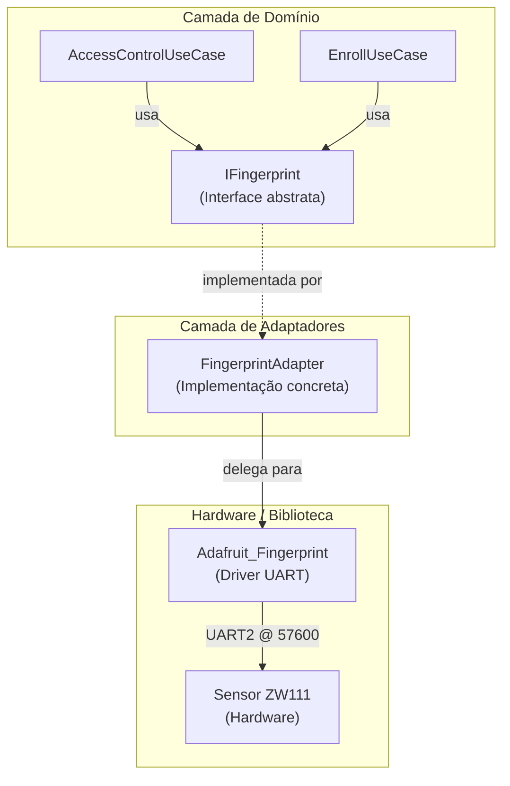
```mermaid
graph TD
    subgraph Domain["Camada de Domínio"]
        IF["IFingerprint\n(Interface abstrata)"]
        ACU["AccessControlUseCase"]
        EU["EnrollUseCase"]
    end

    subgraph Adapters["Camada de Adaptadores"]
        FA["FingerprintAdapter\n(Implementação concreta)"]
    end

    subgraph External["Hardware / Biblioteca"]
        AF["Adafruit_Fingerprint\n(Driver UART)"]
        ZW["Sensor ZW111\n(Hardware)"]
    end

    ACU -->|usa| IF
    EU -->|usa| IF
    IF -.->|implementada por| FA
    FA -->|delega para| AF
    AF -->|UART2 @ 57600| ZW
```

#### Arquivos relevantes

| Camada | Arquivo | Responsabilidade |
|--------|---------|------------------|
| Interface | [IFingerprint.h](file:///s:/dev/UFC/pet-lock/pet-lock-esp/src/Core/Interfaces/IFingerprint.h) | Contrato abstrato com enums de cor e modo LED |
| Adapter | [FingerprintAdapter.h](file:///s:/dev/UFC/pet-lock/pet-lock-esp/src/Adapters/FingerprintAdapter.h) | Declaração da classe concreta |
| Adapter | [FingerprintAdapter.cpp](file:///s:/dev/UFC/pet-lock/pet-lock-esp/src/Adapters/FingerprintAdapter.cpp) | Implementação de todos os métodos |
| Use Case | [AccessControlUseCase.cpp](file:///s:/dev/UFC/pet-lock/pet-lock-esp/src/Core/UseCases/AccessControlUseCase.cpp) | Autenticação (scan → busca → acesso) |
| Use Case | [EnrollUseCase.cpp](file:///s:/dev/UFC/pet-lock/pet-lock-esp/src/Core/UseCases/EnrollUseCase.cpp) | Cadastro (2 capturas → modelo → persistência) |

### Inicialização

A inicialização é feita no `setup()` do [main.cpp](file:///s:/dev/UFC/pet-lock/pet-lock-esp/src/main.cpp):

```cpp
// 1. Cria instância com Serial2 e senha padrão
fingerprintAdapter = new Adapters::FingerprintAdapter(&fingerprintSerial, 0x00000000);

// 2. init() configura UART2 e verifica comunicação com o sensor
fingerprintAdapter->init();
```

Internamente, `init()` executa:

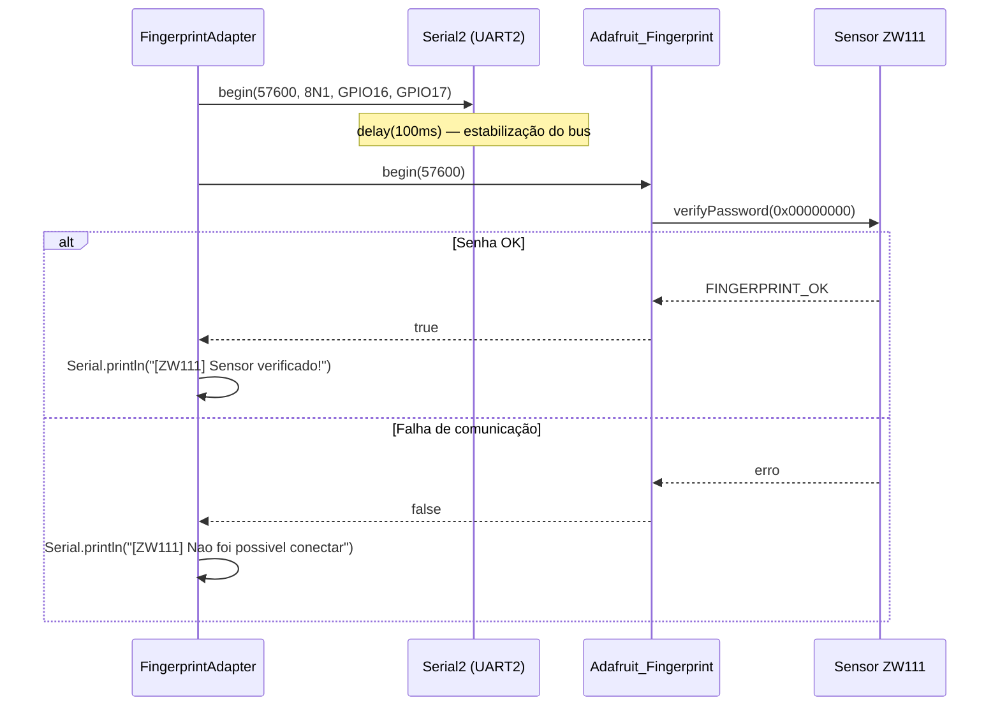
```mermaid
sequenceDiagram
    participant FA as FingerprintAdapter
    participant S2 as Serial2 (UART2)
    participant AF as Adafruit_Fingerprint
    participant ZW as Sensor ZW111

    FA->>S2: begin(57600, 8N1, GPIO16, GPIO17)
    Note over S2: delay(100ms) — estabilização do bus
    FA->>AF: begin(57600)
    AF->>ZW: verifyPassword(0x00000000)
    alt Senha OK
        ZW-->>AF: FINGERPRINT_OK
        AF-->>FA: true
        FA->>FA: Serial.println("[ZW111] Sensor verificado!")
    else Falha de comunicação
        ZW-->>AF: erro
        AF-->>FA: false
        FA->>FA: Serial.println("[ZW111] Nao foi possivel conectar")
    end
```

### API Completa — Interface `IFingerprint`

#### Enums de Configuração

**`FingerprintColor`** — Cores do LED RGB integrado:

| Enum | Valor | Código físico enviado |
|------|-------|-----------------------|
| `RED` | 4 | `0x04` |
| `GREEN` | 2 | `0x02` |
| `BLUE` | 1 | `0x01` |
| `CYAN` | 3 | `0x03` |
| `YELLOW` | 6 | `0x06` |
| `WHITE` | 7 | `0x07` |

**`FingerprintLedMode`** — Modos de operação do LED:

| Enum | Valor | Comportamento |
|------|-------|---------------|
| `BREATHING` | 1 | Pulsação gradual (fade in/out) |
| `FLASHING` | 2 | Pisca rápido N ciclos |
| `ON` | 3 | Aceso continuamente |
| `OFF` | 4 | Desligado |
| `GRADUALLY_CLOSE` | 6 | Acende e apaga gradualmente N ciclos |

#### Métodos

| Método | Retorno | Descrição |
|--------|---------|-----------|
| `init()` | `bool` | Inicializa UART2 e verifica senha do sensor |
| `scan()` | `int16_t` | Captura imagem + converte template + busca no banco |
| `startEnroll(slotId)` | `bool` | Prepara cadastro aguardando retirada do dedo |
| `captureStep(step)` | `bool` | Captura imagem e armazena no buffer 1 ou 2 (timeout 10s) |
| `searchCurrentTemplate()` | `int16_t` | Busca o template do buffer 1 no banco (anti-duplicidade) |
| `saveModel(slotId)` | `bool` | Combina buffers 1+2 e persiste no slot |
| `deleteModel(slotId)` | `bool` | Remove template de um slot específico |
| `clearDatabase()` | `bool` | Apaga todos os 40 templates do sensor |
| `setLed(mode, color, cycles)` | `void` | Controla LED RGB via pacote UART customizado |
| `getCount()` | `uint8_t` | Retorna quantos templates estão cadastrados |
| `getFirstFreeSlot()` | `int8_t` | Varre slots 1–40 e retorna o primeiro livre (-1 se cheio) |
| `waitFingerReleased()` | `void` | Bloqueia até o dedo ser removido (polling 100ms) |

#### Códigos de Retorno de `scan()`

| Valor | Significado | Ação da AuthTask |
|-------|-------------|------------------|
| `> 0` | Slot do template encontrado (1–40) | `processFingerprintAccess(slot)` |
| `0` | Sem dedo no sensor | Nenhuma ação, próximo ciclo |
| `-1` | Dedo detectado mas não cadastrado | `processFingerprintAccessDenied()` |
| `-2` | Erro de comunicação/imagem | Nenhuma ação, próximo ciclo |

#### Códigos de Retorno de `searchCurrentTemplate()`

| Valor | Significado | Ação do EnrollUseCase |
|-------|-------------|----------------------|
| `> 0` | Slot onde a digital já existe | Aborta enroll — "Digital já cadastrada" |
| `0` | Digital nova (não encontrada) | Prossegue para captureStep(2) |
| `-1` | Erro de comunicação | Aborta enroll |

### Fluxo Interno — `scan()` (Leitura e Reconhecimento)

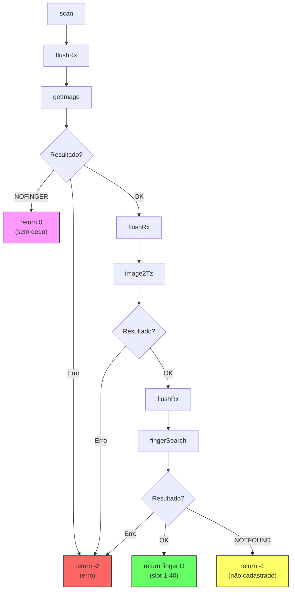
```mermaid
flowchart TD
    A[scan] --> B[flushRx]
    B --> C[getImage]
    C --> D{Resultado?}
    D -->|NOFINGER| E["return 0\n(sem dedo)"]
    D -->|Erro| F["return -2\n(erro)"]
    D -->|OK| G[flushRx]
    G --> H[image2Tz]
    H --> I{Resultado?}
    I -->|Erro| F
    I -->|OK| J[flushRx]
    J --> K[fingerSearch]
    K --> L{Resultado?}
    L -->|OK| M["return fingerID\n(slot 1-40)"]
    L -->|NOTFOUND| N["return -1\n(não cadastrado)"]
    L -->|Erro| F

    style E fill:#f9f,stroke:#333
    style F fill:#f66,stroke:#333
    style M fill:#6f6,stroke:#333
    style N fill:#ff6,stroke:#333
```

### Fluxo Interno — Cadastro Completo (Enroll)

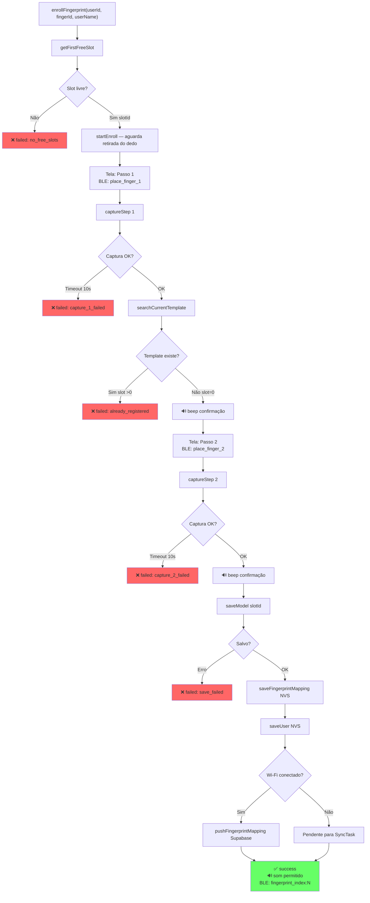
```mermaid
flowchart TD
    A["enrollFingerprint(userId, fingerId, userName)"] --> B[getFirstFreeSlot]
    B --> C{Slot livre?}
    C -->|Não| D["❌ failed: no_free_slots"]
    C -->|Sim slotId| E[startEnroll — aguarda retirada do dedo]
    E --> F["Tela: Passo 1\nBLE: place_finger_1"]
    F --> G[captureStep 1]
    G --> H{Captura OK?}
    H -->|Timeout 10s| I["❌ failed: capture_1_failed"]
    H -->|OK| J[searchCurrentTemplate]
    J --> K{Template existe?}
    K -->|Sim slot >0| L["❌ failed: already_registered"]
    K -->|Não slot=0| M["🔊 beep confirmação"]
    M --> N["Tela: Passo 2\nBLE: place_finger_2"]
    N --> O[captureStep 2]
    O --> P{Captura OK?}
    P -->|Timeout 10s| Q["❌ failed: capture_2_failed"]
    P -->|OK| R["🔊 beep confirmação"]
    R --> S[saveModel slotId]
    S --> T{Salvo?}
    T -->|Erro| U["❌ failed: save_failed"]
    T -->|OK| V[saveFingerprintMapping NVS]
    V --> W[saveUser NVS]
    W --> X{Wi-Fi conectado?}
    X -->|Sim| Y[pushFingerprintMapping Supabase]
    X -->|Não| Z[Pendente para SyncTask]
    Y --> AA["✅ success\n🔊 som permitido\nBLE: fingerprint_index:N"]
    Z --> AA

    style D fill:#f66
    style I fill:#f66
    style L fill:#f66
    style Q fill:#f66
    style U fill:#f66
    style AA fill:#6f6
```

### Gerenciamento de Slots

O sensor ZW111 possui **40 slots internos** (posições 1–40) para armazenar templates biométricos. O mapeamento entre um slot físico do sensor e um usuário do sistema é mantido na NVS Flash do ESP32:

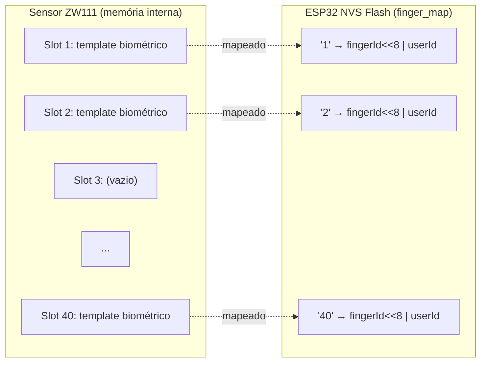
```mermaid
graph LR
    subgraph Sensor["Sensor ZW111 (memória interna)"]
        S1["Slot 1: template biométrico"]
        S2["Slot 2: template biométrico"]
        S3["Slot 3: (vazio)"]
        S4["..."]
        S40["Slot 40: template biométrico"]
    end

    subgraph NVS["ESP32 NVS Flash (finger_map)"]
        M1["'1' → fingerId<<8 | userId"]
        M2["'2' → fingerId<<8 | userId"]
        M40["'40' → fingerId<<8 | userId"]
    end

    S1 -.->|mapeado| M1
    S2 -.->|mapeado| M2
    S40 -.->|mapeado| M40
```

#### Busca de Slot Livre — `getFirstFreeSlot()`

```cpp
// Varre sequencialmente os 40 slots tentando carregar cada modelo.
// Se loadModel() falhar (FINGERPRINT_OK não retornado), o slot está vazio.
for (uint8_t i = 1; i <= 40; i++) {
    flushRx();
    if (_finger.loadModel(i) != FINGERPRINT_OK) {
        return i; // Slot livre!
    }
}
return -1; // Todos os 40 slots ocupados
```

> [!WARNING]
> A busca de slot livre é **sequencial e bloqueante** — no pior caso, executa 40 comandos UART. Isso é aceitável pois ocorre apenas durante o cadastro (EnrollUseCase), quando a AuthTask já está suspensa via flag `isEnrolling`.

### Protocolo UART — Pacote de Controle do LED

O LED RGB integrado ao sensor é controlado por um pacote UART customizado enviado diretamente pela implementação do adapter (não pela biblioteca Adafruit):

```
Offset:  0    1    2    3    4    5    6    7    8    9    10   11   12   13   14   15
Byte:   EF   01   FF   FF   FF   FF   01   00   07   3C   MM   SC   EC   CC   CH   CL
        ─────────  ───────────────────  ──   ─────────  ──   ──   ──   ──   ──   ─────
        Header     Endereço (broadcast)  PID  Tamanho   Cmd  Mode Start End  Cyc  Checksum
```

| Campo | Bytes | Offset | Descrição |
|-------|-------|--------|-----------|
| Header | `EF 01` | 0–1 | Identificador fixo do protocolo ZFM |
| Address | `FF FF FF FF` | 2–5 | Endereço broadcast (todos os módulos) |
| Packet ID | `01` | 6 | Tipo: comando |
| Length | `00 07` | 7–8 | 7 bytes de dados a seguir |
| Instruction | `3C` | 9 | Código da instrução "Control LED" |
| Mode | 1 byte | 10 | `01`=Breathing, `02`=Flashing, `03`=ON, `04`=OFF, `06`=GradualClose |
| Start Color | 1 byte | 11 | Cor inicial (ver tabela de cores) |
| End Color | 1 byte | 12 | Cor final (igual à inicial no uso atual) |
| Cycles | 1 byte | 13 | Nº de repetições (`0` = infinito) |
| Checksum | 2 bytes | 14–15 | `PID + Length_H + Length_L + Instruction + Mode + StartColor + EndColor + Cycles` |

**Cálculo do checksum:**
```cpp
uint16_t sum = 0x01 + 0x00 + 0x07 + 0x3C + mode + startColor + endColor + cycles;
// Enviado como 2 bytes: sum >> 8 (high), sum & 0xFF (low)
```

### Estratégia de Flush (`flushRx`)

O método `flushRx()` é invocado **antes de cada operação UART** com o sensor:

```cpp
void FingerprintAdapter::flushRx() {
    while (_serial->available()) {
        _serial->read();  // Descarta todos os bytes pendentes
    }
}
```

> [!IMPORTANT]
> O flush é necessário porque o sensor pode enviar bytes de resposta residuais (de comandos anteriores ou ruído na linha). Sem o flush, a biblioteca `Adafruit_Fingerprint` pode interpretar bytes residuais como resposta do comando atual, causando falsos negativos ou erros de comunicação.

**Pontos de chamada do `flushRx()`:**

| Método | Nº de chamadas | Motivo |
|--------|----------------|--------|
| `scan()` | 3× | Antes de `getImage()`, `image2Tz()`, e `fingerSearch()` |
| `captureStep()` | 2× | Antes de `getImage()` (no loop) e `image2Tz()` |
| `searchCurrentTemplate()` | 1× | Antes de `fingerSearch()` |
| `saveModel()` | 2× | Antes de `createModel()` e `storeModel()` |
| `deleteModel()` | 1× | Antes de `deleteModel()` |
| `clearDatabase()` | 1× | Antes de `emptyDatabase()` |
| `getCount()` | 1× | Antes de `getTemplateCount()` |
| `getFirstFreeSlot()` | 1× por slot | Antes de cada `loadModel()` |
| `waitFingerReleased()` | 1× por iteração | Antes de cada `getImage()` no polling |
| `sendLedCommand()` | 1× | Antes de enviar o pacote UART raw |

Adicionalmente, no [main.cpp](file:///s:/dev/UFC/pet-lock/pet-lock-esp/src/main.cpp) (`vBleTaskCode`), antes de iniciar um enroll, a `BleTask` faz um flush manual do buffer da `Serial2`:

```cpp
// Esvazia buffer serial do leitor para evitar leituras de lixo residual
while (fingerprintSerial.available()) {
    fingerprintSerial.read();
}
```

### Concorrência e Acesso ao Sensor

O sensor é acessado por **duas tasks** em momentos mutuamente exclusivos:

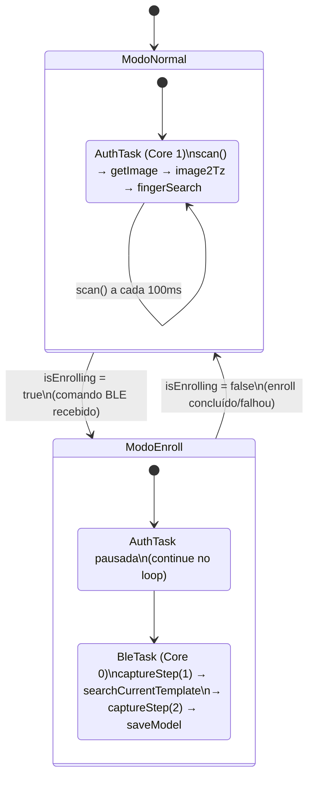
```mermaid
stateDiagram-v2
    [*] --> ModoNormal

    state ModoNormal {
        [*] --> AuthTask_Lendo
        AuthTask_Lendo --> AuthTask_Lendo: scan() a cada 100ms
        AuthTask_Lendo: AuthTask (Core 1)\nscan() → getImage → image2Tz → fingerSearch
    }

    ModoNormal --> ModoEnroll: isEnrolling = true\n(comando BLE recebido)

    state ModoEnroll {
        [*] --> AuthTask_Suspensa
        AuthTask_Suspensa: AuthTask pausada\n(continue no loop)
        AuthTask_Suspensa --> BleTask_Enroll
        BleTask_Enroll: BleTask (Core 0)\ncaptureStep(1) → searchCurrentTemplate\n→ captureStep(2) → saveModel
    }

    ModoEnroll --> ModoNormal: isEnrolling = false\n(enroll concluído/falhou)
```

> [!IMPORTANT]
> A exclusão mútua **não** é feita por mutex, mas por uma **flag volátil** `isEnrolling`. Quando `true`, a `AuthTask` simplesmente ignora o ciclo de leitura (`continue`). A `BleTask` aguarda 200ms após setar a flag para garantir que a `AuthTask` finalize qualquer operação UART em andamento antes de iniciar o enroll.
